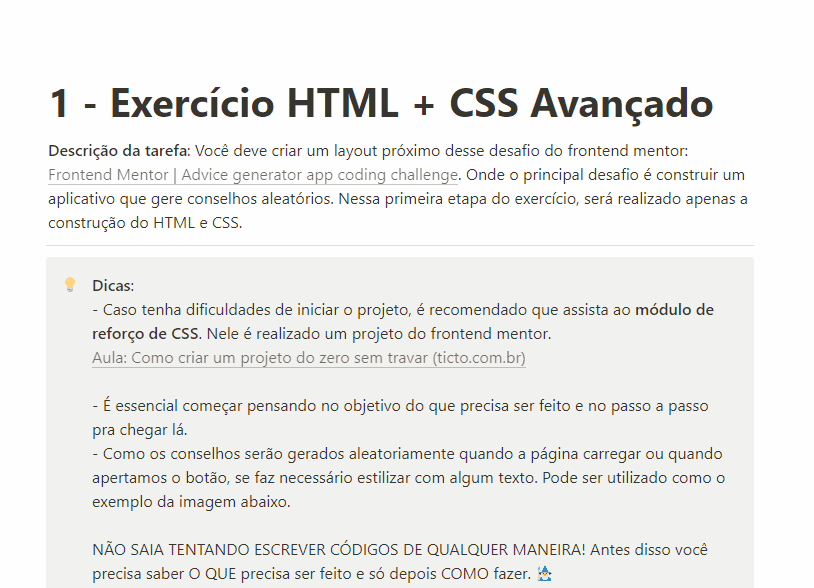
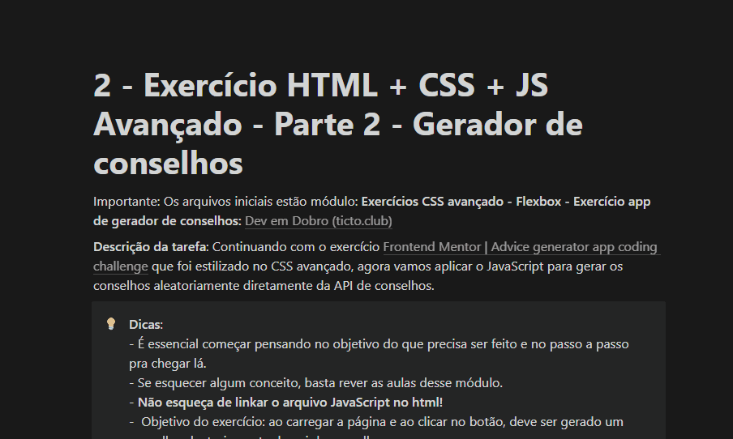

<h1>Advice Generator</h1>
Exercício do curso DevQuest para praticar Html, Css e Javascript.

 

<h2>Tecnologias utilizadas:</h2>

- HTML
- CSS
- Javascript
- [Advice Slip Json API](https://api.adviceslip.com/)

 

<h2>Como utilizar o projeto</h2>
- Clique ou pressione o botão verde com o ícone de um dado para que um novo conselho seja adicionado ao cartão. Será alterado o texto do conselho e o número identificador do mesmo.
- É necessário aguardar 2 segundos para solicitar um novo conselho. 

<h2>Descrições do exercício:</h2>

<h3>HTML + CSS (Parte1):</h3>

<h3>JavaScript (Parte2):</h3>

 

<h2>Dificuldades:</h2>

- A princípio, dificuldade com responsividade e em como selecionar os valores do conselho gerado.

 

<h2>Aprendizado:</h2>

- Utilização da extensão do Google Chrome PerfectPixel, para auxiliar na responsividade e obter o melhor resultado.
- Fazer chamadas de API com fetch e adicionar os valores capturados no HTML utilizando o DOM.

 

<h3>Créditos:</h3>
Exercício criado por <a href="https://www.frontendmentor.io/challenges/advice-generator-app-QdUG-13db" target="_blank">Front-end mentor</a>,
reformulado e simplificado por <a href="https://github.com/devemdobro/devemdobro" target="_blank">Dev em dobro</a>,
reproduzido por John Dalton.

